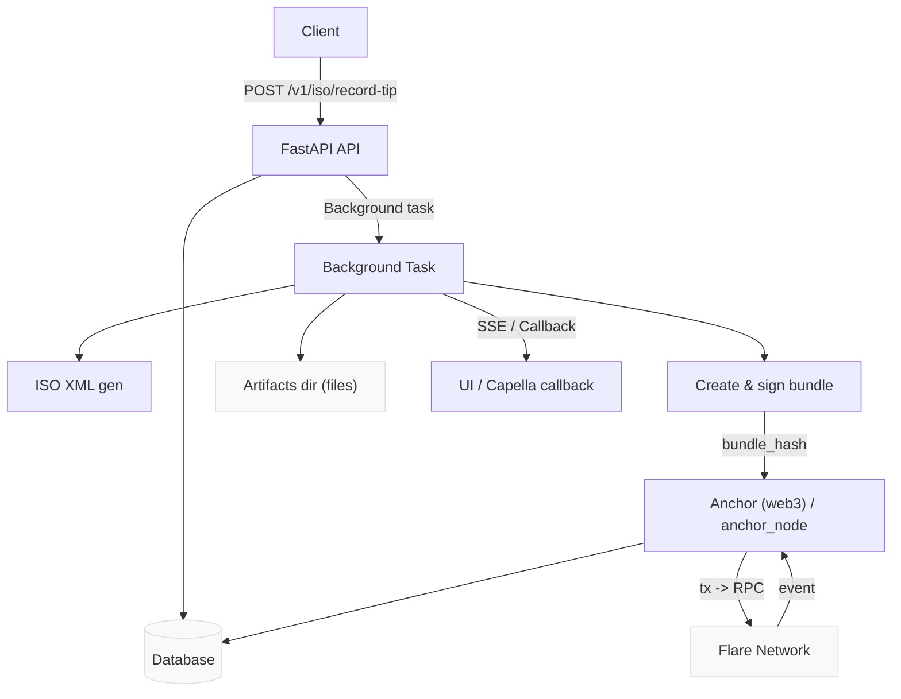
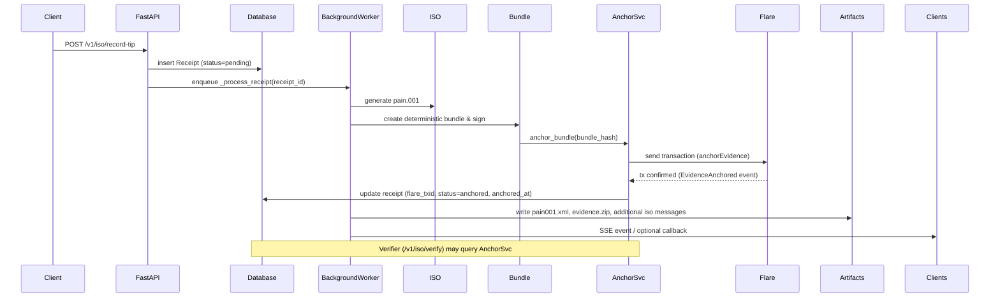

# Architecture Overview 

This document shows how the core middleware processes a request to anchor evidence on the Flare network, why a database is required, and how artifacts / receipts are stored and verified.

## High-level flow 

1. Client POSTs a tip: `POST /v1/iso/record-tip` (includes chain, tip_tx_hash, amount, wallets, optional callback)
2. API validates API key and writes a **Receipt** (status: `pending`) into the **Database** (SQLAlchemy: `app/db.py`, models in `app/models.py`).
3. A background task builds the ISO XML (`app/iso.py`) and creates a deterministic, signed bundle (`app/bundle.py`).
4. The bundle hash is computed (SHA-256, 0x-prefixed). The service attempts to anchor it on Flare using the Python `anchor` module (`app/anchor.py`) or the Node fallback `anchor_node`.
5. If anchor succeeds, anchor transaction ID is recorded (receipt.flare_txid) and receipt.status set to `anchored`; otherwise status becomes `failed`.
6. Artifacts (XML, bundle.zip, generated ISO messages) are written to the `artifacts/{receipt_id}/` directory and served statically by the API.
7. SSE (Server-Sent Events) updates are published for live UI updates and an optional callback to an external system (e.g., Capella) is fired.

## Why the Database is needed 

The database stores the bundle hash and artifact paths (columns: `bundle_hash`, `xml_path`, `bundle_path`); the actual files are kept on disk under `artifacts/{receipt_id}/` and served via `/files`.

- **Durability & Audit**: Persist receipt records, bundle_hash, flare_txid, timestamps and status for audit and reporting.
- **Idempotency & Deduplication**: Ensure the same on-chain tip is not recorded twice (dedupe by chain + tip_tx_hash).
- **Search & Reporting**: Produce statements (camt052/camt053) and list receipts per project or timeframe.
- **Recovery & Retry**: Track failed anchors and allow manual or automated retry without rebuilding artifacts.
- **Access Control / Projects**: Map receipts to `project_id` and enforce ownership when listing or retrieving.

Note: The app supports `DATABASE_URL` (Postgres for production) and falls back to SQLite for local dev (`app/db.py`).

## Components & Roles 

- **FastAPI API (`app/main.py`)** – receives requests, writes receipt row, schedules background work.
- **ISO generator (`app/iso.py`)** – creates `pain.001` and other ISO messages.
- **Bundle & Sign (`app/bundle.py`)** – creates deterministic evidence bundle and computes a SHA-256 bundle hash.
- **Anchor modules (`app/anchor.py`, `app/anchor_node.py`)** – call `anchorEvidence` on the EvidenceAnchor contract and scan logs for `EvidenceAnchored`.
- **Database (SQLAlchemy)** – `models.Receipt`, `models.ApiKey` etc, used across API and background tasks.
- **Artifacts dir (`artifacts/`)** – filesystem storage for XML and zip bundles served via `/files`.
- **SSE hub (`app/sse.py`)** – streams real-time receipt updates to clients.
- **Flare Network** – RPC endpoint defined by `FLARE_RPC_URL`; evidence anchor contract address `ANCHOR_CONTRACT_ADDR`.

## Visual Diagrams

### Flowchart (Mermaid)

### Sequence (Mermaid)

## Operational notes & env variables 

- FLARE_RPC_URL — RPC node (Coston2 testnet or mainnet)
- ANCHOR_CONTRACT_ADDR — EvidenceAnchor contract address
- ANCHOR_PRIVATE_KEY — used to sign anchor transactions
- DATABASE_URL — Postgres preferred in production
- ARTIFACTS_DIR — where files are persisted and served from
- VERIFY_AUTO_ANCHOR — if enabled, /verify may auto-anchor missing bundles

## Quick reference to code locations 

- API & flow: `app/main.py`
- Anchoring: `app/anchor.py`, `app/anchor_node.py`
- DB helper: `app/db.py`
- Bundle: `app/bundle.py`
- ISO messages: `app/iso.py` and `app/iso_messages/`
- Artifacts directory: `artifacts/`

